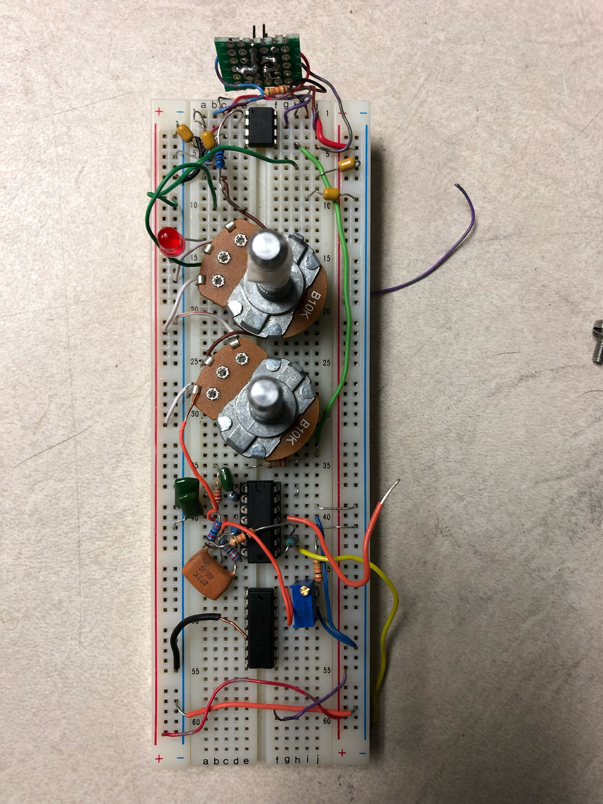
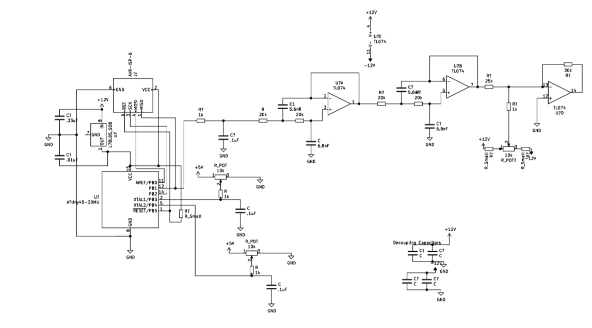

 
=======

## The Problem
With only 1-2 wave analog waveforms, LFOs on older synthesizers, specifically the moog prodigy, are severely limited in their capabilities. Since LFOs are control functions and do not directly enter into the audio output, there is no benefit of the circuitry that initially creates these functions. These synthesizers would be better served by a more robust LFO design.
`

## The Solution
Utilizing an Attiny45 I have developed an LFO that can be retrofitted into synthesizers to increase LFO functions. These would include square (bipolar and unipolar), saw, reverse saw, triangle, sine and sample, and hold waveforms. This solution is cost effective using an 8 bit microcontroller that costs under a dollar, and minimal analog components.
 
## The algorithms 
Algorithms for the LFO shapes are simple and concise. By varying a PWM utility on the Attiny, we output a varying pulse square wave that once filtered creates smooth control functions.

### Saw 
```
uint8_t sawtooth(uint8_t* step){
	(*step)++;
	return *step;
}
```

### Reverse Saw
```
uint8_t reversesaw(uint8_t* step){
	(*step)--;

	return *step;
}
```

### Triangle 
```
uint8_t triangle(uint8_t* step){
	static int ud = 0;
	if (ud){
		*step -= 2;
		if(!*step){
			ud = 0;
		}
		} else {
		*step += 2;
		if (*step == 254){
			ud = 1;
		}
	}
	return *step;
}
```

### Unipolar Square 
```
uint8_t square_p(uint8_t* count){
	static int freq = 126;
	(*count)++;
	static uint8_t val = 0x7F;
	if(*count < freq){
		val = 0x7F;
		} else {
		val = 0xFE;
	}
	*count %= 2*freq;

	return val;
}

uint8_t square_n(uint8_t* count){
	static int freq = 126;
	(*count)++;
	static uint8_t val = 0x01;
	if(*count < freq){
		val = 0x01;
		} else {
		val = 0x7F;
	}
	*count %= 2*freq;
	
	return val;
}
```
### Bipolar Square
```
uint8_t square_f(uint8_t* count){

	static int freq = 126;
	(*count)++;
	static uint8_t val = 0x01;
	if(*count < freq){
		val = 0x01;
		} else {
		val = 0xFE;
	}
	*count %= 2*freq;

	return val;
}
```

### Sample and Hold
```
uint8_t sampleAndHold(uint8_t* count){
	static uint8_t b = 0;
	static uint8_t i = 0;
	if(i == 0){
		int a = rand();
		b = 0xFF & a;
	}
	//(*count)++;
	
	return b;
}
``` 
Note: After some time it was determined that the random function was more reliably random than an LFSR. I hope to modify this code to include a modified call to my machine code routine for white noise generation so that I do not need library calls and can keep the program as lightweight as possible. 

### Sine

```
uint8_t sinewave_(uint8_t* i){
	uint8_t val = pgm_read_byte(&sinewave[(*i)++]) / mod_scale + 128 - (256/(mod_scale * 2));
	(*i) %= 256;
	return val;
}
```

## Varying the Frequency
In order to vary the Frequency, I implemented a delay function as well as a mapping function to take my inputs from the ADCs and map them to a piecewise logarithmic modeling function to bring the frequency from 0.3 Hz to 30Hz

 ```
 uint16_t map_m(uint16_t input_end, uint16_t        input_start, uint16_t output_end,               uint16_t output_start,  uint16_t input){
	uint16_t slope = (output_end - output_start) / (input_end - input_start);
	uint16_t output = output_start + slope * (input - input_start);
	return output;
}

int16_t VoltageToDelay (uint16_t volt){
	if(volt < 500){
		return map_m(500, 50, 800, 60, volt);
	} else {
		return map_m(1024, 500, 9200, 700, volt);
	}
	
	return 60 + (volt * 4);			//9000 top value (.3 Hz)  60 - 30 Hz
}

 ```

### Feature Freak
In developing the LFO, we aimed to be as thorough as possible. We utilized all 8 pins on the Attiny45. 

#### 3 Control Pots
By adding a third pot, we tried to implement new effects. One, an amplitude varying waveform based off timing determined by the third pot. We soon learned that reading 3 pots this quickly causes system failure. Delays and skips would occur, ruining our waveform. One possible solution for this would be implementing a rigorous RTOS, though I have yet to attempt implementation.  

Instead, we decided to create a button that would allow modes to be switched and the time varying amplitude to become one of the two control functions, replacing the waveform chooser. It is important that musicians have access to the effects they are using and we hope that this tradeoff will still benefit them.

#### Varying Amplitude with Phase Modulation and Interpolation/Dithering
    The low 12-bit resolution of our PWM forced us to resort to clever bit calculations in an attempt to smooth low amplitude wave forms. As we reduce amplitude, we reduce our bit resolution since we are only afforded smaller values. We are only able to use the least significant byte of our available bits when faced with a signal at half the amplitude. In order to get around this, we attempted a version of interpolation through dithering. When at intermediate phases of a waveform — whenever there are x number of steps between the current sample and the next sample — we switch between the available bits to simulate higher bit resolution.
Unfortunately this did not give us much greater resolution. 

Additionally, in order to create the amplitude variation, we implemented a phasing system. By combining a waveform out of phase with the output waveform, amplitude can be reduced or increased. In order to vary the amplitude, I simply varied the phase of a following waveform until the time step finished. 

```
uint8_t dither_up(uint8_t old_val, uint8_t new_val, uint8_t og_delay, uint8_t curr_delay){
	uint8_t difference = new_val - old_val;
	uint8_t num_cycles = og_delay / CYCLE_US;
	uint8_t curr_cycle = curr_delay / CYCLE_US;
	switch (difference){
		case 1 : {
			if(curr_cycle % 2) {
				return new_val;
				} else {
				return old_val;
			}
			break;
		}
		case 2: {
			uint16_t scaled = (100*curr_cycle) / num_cycles;
			if(scaled <= 33){
				return old_val;
			} else if (scaled <= 66){
				return old_val + 1;
			} else {
				return old_val + 2;
			}
			break;
		}
		case 3: {
			uint16_t scaled = (100*curr_cycle) / num_cycles;
			if(scaled <= 25){
				return old_val;
			} else if (scaled <= 50){
				return old_val + 1;
			} else if (scaled <= 75){
				return old_val + 2;
			} else {
				return old_val + 3;
			}
			break;
		}
	}
}
```
```
uint8_t dither_down(uint8_t old_val, uint8_t new_val, uint8_t og_delay, uint8_t curr_delay){
	uint8_t difference = old_val - new_val;
	uint8_t num_cycles = og_delay / CYCLE_US;
	uint8_t curr_cycle = curr_delay / CYCLE_US;
	switch (difference){
		case 1 : {
			if(curr_cycle % 2) {
				return new_val;
				} else {
				return old_val;
			}
			break;
		}
		default: {
			uint16_t scaled = (100*curr_cycle) / num_cycles;
			if(scaled <= 33){
				return old_val;
				} else if (scaled <= 66){
				return old_val - 1;
				} else {
				return old_val - 2;
			}
			break;
		}
	}
}
```
```
uint8_t dither(int16_t delay, uint8_t old_val){
	uint8_t next_val = wave_ptr(&i);// / mod_scale  + 128 - (256/(mod_scale * 2)); 
	uint8_t h = i + 100;
	uint8_t phaseOffset = wave_ptr(&h);
	//successive approx
	if(half < 16){
		if(next_val >= 128){
			next_val += (256/(mod_scale*half));
		}
		else {
			next_val -= (256/(mod_scale*half));
		}
	}
	int8_t difference;
	uint8_t og_delay = delay;
	while (delay > CYCLE_US * 3){
		if((difference = old_val - next_val) <= 3 && difference > 0){
			OCR0A = dither_down(old_val, next_val, og_delay, delay);
			} else if (difference >= -3 && difference < 0){
			OCR0A = dither_up(old_val, next_val, og_delay, delay);
		}
		_delay_us(CYCLE_US);
		delay = delay - CYCLE_US;
		
	}
	while(delay){
		_delay_us(1);
		delay--;
	}
	uint8_t phased = next_val + phaseOffset;
	if(phased < next_val){
		phased = 256 - phased; 
	}
	return next_val + phased;
}
```


# Future Plans
The plan for the Retro-LFO is to develop a PCB and begin offering it as an enhancement during synthesizer repairs at Retrolinear, as well as market it to eurorack enthusiasts on the web.
